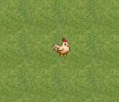

# Краткая характеристика: 

- Наименование программы: **Road of life**.
- Назначение программы: игровая программа для **развлечения**.
- Конечные пользователи: **любители игр** на платформе PC.

# Техническое задание:

Разработать игровое приложение на языке Python с использованием возможностей **библиотеки PyGame**.

# Сборка и запуск:

# Функциональные возможности:

Игрок управляет персонажем, пытаясь, **перебежать дорогу** так, чтобы его не сбили машины.
Конечная цель — набрать **наибольшее количество очков**.

### Игрок ###

Мы управляем действиями игрового персонажа. Он может двигаться вперёд, назад, вправо и влево
При контакте с машиной игрок **умирает**.

### Враги-препятсвия ###

Машины или условные враги будут выезжать с края игрового экрана и ехать только по своей полосе.
При увеличении уровня скорость машины будет постепенно увеличиваться

# Игровой интерфейс:
### Стартовый экран: ###

Для начала игры нужно нажать пробел.

**Далее вы увидите следующую картину:**

Курица (главный герой игры) стоит на игровом поле.

Для передвижения используются клавиши стрелок. Для управления фоновой музыкой используются следующие клавиши:

- F1 - уменьшение громкости музыки
- F2 - увеличение громкости музыки
- M - Пауза/Старт музыки

 ### Геймпей ###
Вы управляете курицей, которая должна перебежать дорогу и прийти к своему гнезду, которое выглядит так:

Слева сверху показано максимальное количество очков за все попытки:

Если у вас удастся дойти до гнезда, то вы пройдёте игру:

### Удачной игры, надеюсь вы спасёте своих цыплят :) ###
